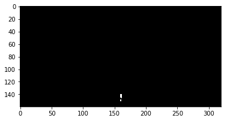

## Project: Search and Sample Return
---

**The goals / steps of this project are the following:**  

**Training / Calibration**  

* Download the simulator and take data in "Training Mode"
* Test out the functions in the Jupyter Notebook provided
* Add functions to detect obstacles and samples of interest (golden rocks)
* Fill in the `process_image()` function with the appropriate image processing steps (perspective transform, color threshold etc.) to get from raw images to a map.  The `output_image` you create in this step should demonstrate that your mapping pipeline works.
* Use `moviepy` to process the images in your saved dataset with the `process_image()` function.  Include the video you produce as part of your submission.

**Autonomous Navigation / Mapping**

* Fill in the `perception_step()` function within the `perception.py` script with the appropriate image processing functions to create a map and update `Rover()` data (similar to what you did with `process_image()` in the notebook). 
* Fill in the `decision_step()` function within the `decision.py` script with conditional statements that take into consideration the outputs of the `perception_step()` in deciding how to issue throttle, brake and steering commands. 
* Iterate on your perception and decision function until your rover does a reasonable (need to define metric) job of navigating and mapping.  

[//]: # (Image References)

[image1]: ./misc/rover_image.jpg
[image2]: ./calibration_images/example_grid1.jpg
[image3]: ./calibration_images/example_rock1.jpg 

## [Rubric](https://review.udacity.com/#!/rubrics/916/view) Points

---
### Writeup / README

#### 1. Provide a Writeup / README that includes all the rubric points and how you addressed each one.  You can submit your writeup as markdown or pdf.  

This is it!

### Notebook Analysis
#### 1. Run the functions provided in the notebook on test images (first with the test data provided, next on data you have recorded). Add/modify functions to allow for color selection of obstacles and rock samples.
* Changed data directory paths to `rec_data`.  
* Modified `color_thresh` function to filter for rock samples and obstacles in addition to navigable terrain.  For rock samples (yellow), the filter was: not navigable, pixel R value > 100, pixel R and G values approximately equal (0.8 to 1.2 ratio allowable), and pixel B value less than half of the pixel R value.  For obstacles, the filter was: not navigable, not a rock sample, R+G+B > 0 to avoid labeling the unseen areas out of view of the camera but present on the warped image, and R, G, B &lt; 100.  Rock filter output for the rock sample image was plotted to ensure the yellow filter worked correctly. 
* Completed coordinate transform functions for `rotate_pix` and `translate_pix`

#### 1. Populate the `process_image()` function with the appropriate analysis steps to map pixels identifying navigable terrain, obstacles and rock samples into a worldmap.  Run `process_image()` on your test data using the `moviepy` functions provided to create video output of your result. 
* Populated process_image function by defining source and destination points for perspective transform, applying the transform, feeding the transform through the `color_thresh` function above, and writing a worldcoord function to transform rover map view (warped) coordinates to world coordinates.  Then used binary thresholds data for navigable, rocks, and obstacles to update data.worldmap and generate a combined warped threshold image.  For the worldmap update, RGB values were restricted to an upper bound of 255 to avoid rendering problems for frequently visited areas.
* Original image, threshold view, and worldmap overlay on ground truth map were all shown on the output video mosaicatom.

### Autonomous Navigation and Mapping

#### 1. Fill in the `perception_step()` (at the bottom of the `perception.py` script) and `decision_step()` (in `decision.py`) functions in the autonomous mapping scripts and an explanation is provided in the writeup of how and why these functions were modified as they were.
* Most of the `perception_step` modifications were copies from the Jupyter Notebook with 'data' replaced by 'Rover'.  A restriction was added to worldmap updating so that the navigable, obstacle, and rock pixels are only recorded on the map if the rover pitch and roll are very small (less than 1 and 1.5deg respectively).  If the rover is within view of a rock sample, Rover.mode was set to 'rock' to initiate retrieval, and the nav_dists and nav_angles updates were calculated using only the rock pixels rather than the navigable terrain pixels to drive the rover directly towards the rock rather than continuing its nominal path.
* In `decision_step`, the following modifications were made to force the rover to follow the left wall (maze-solving technique): steering angle was biased by taking the mean of only the 75% most left-aligned nav_angles rather than the full set, 'stop' mode turned the rover to the right to find the next left-handed wall, and 'reverse' mode steered to the left when throttling backward and to the right when throttling forward to keep obstacles to the rover's left when resuming forward motion.  To avoid erratic drunk driving behavior, steering angles were clipped to -10,10deg at max velocity.  Rover.mode = 'reverse' was added to clear the rover from obstacles by attempting a series of extraction maneuvers and exiting the mode when the rover achieves velocity > .5 or runs out of moves; this mode is triggered when velocity = 0 for 5 or more frames.  Rover.mode = 'rock' was added to steer the rover towards any rock in view and execute the pickup; this mode is triggered by the `perception_step`.
* The RoverState class in `drive_rover.py` was modified as follows: 
- self.stuck added to determine whether the rover was stuck on an obstacle by counting the number of consecutive velocity = 0 frames; sets Rover.mode='reverse'
- self.reverse_ct added to track the number of cycles executed in the obstacle extraction routine (Rover.mode='reverse')
- self.angle_ct added to count consecutive large left turn commands at high speed (aka rover driving in a donut)
- stop_forward threshold was changed to 250 to keep the rover from running into obstacles as frequently

#### 2. Launching in autonomous mode your rover can navigate and map autonomously.  Explain your results and how you might improve them in your writeup.  
* Screen resolution: 800x600; Graphics quality: Good; FPS output to terminal: 11-13

* Rover is routinely capable of mapping 75-95% of the world with 60-70% fidelity, retrieving 4-5 rocks.  However, the current iteration is very very slow because navigation by decision tree is very inefficient, and the rover is prone to retracing its steps and taking a long time to extract itself from obstacles.

* The navigation technique used was rudimentary left-hand-on-wall tracing.  This generally performed well with two exceptions.  One, the rover would become trapped in a perpetual left turning donut if it was in a wide-open space, so the self.angle_ct counter and a donut breaking statement had to be hard coded.  Two, because the rover would abandon its route to head towards any rock sample in view, this would occasionally cause the rover to collect a rock and u-turn prematurely, leading to incomplete mapping of the path it had been traveling.

* Future improvements: higher fidelity, smarter path planning to prevent the rover from retracing its steps and taking mapping detours to retrieve rocks, a faster and more elegant obstacle extraction procedure than the series of hardcoded maneuvers, handling of multiple rocks in view (currently rover only retrieves the closest then resumes wandering), and a deep learning algorithm for teaching the rover rather than hard coding decisions.

